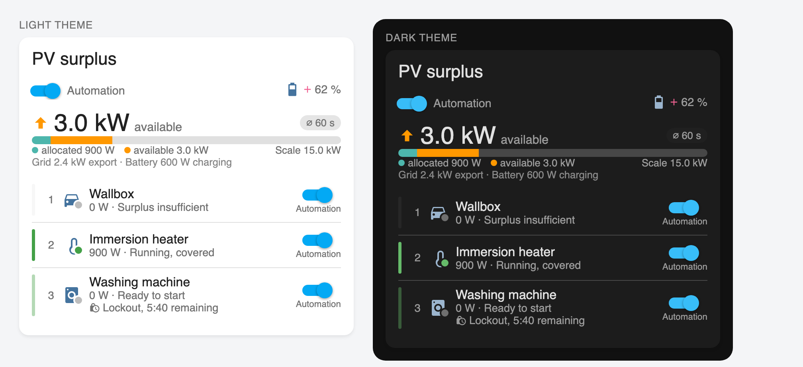

# Energy Manager Card

A Lovelace card for Home Assistant that displays the current **PV surplus** and lists loads **by
priority**. Answers one question at a glance: is there enough surplus for this device?

It is the display half of the
**[Energy Manager Integration](https://github.com/eltomato89/EnergyManagerIntegration)**: the
integration calculates the surplus, keeps the loads and switches them automatically by priority —
the card finds it on its own and displays it. **Loads are maintained exclusively in the
integration.**

Without the integration the card shows the surplus from sensors you configure yourself, but no
loads: those are created there. Existing `devices` lists from earlier versions are still rendered,
but can only be changed in YAML.



<sub>Shown: 2.4 kW export plus 600 W battery charging make 3.0 kW of available surplus. The wallbox
needs at least 4.2 kW and stays grey, the immersion heater is running and covered, the washing
machine would be ready — but is still under its minimum off time.</sub>

<sub>Note: the image was produced in a test environment (`tools/preview.html`). The card itself is
the shipped bundle; the surrounding Home Assistant elements (card frame, toggles, state icons) are
recreated for the screenshot and look slightly different in a real installation.</sub>

## Installation

### HACS (recommended)

1. HACS → Dashboard → ⋮ menu → **Custom repositories**
2. Add the repository URL, category **Dashboard**
3. Install "Energy Manager Card"
4. Clear the browser cache (Ctrl+F5)

### Manual

1. Copy `energy-manager-card.js` from the [latest release](../../releases/latest) to `/config/www/`
2. Settings → Dashboards → ⋮ → Resources → Add:
   URL `/local/energy-manager-card.js?v=0.5.1`, type **JavaScript module**

## Configuration

Everything that concerns the card itself can be set in the graphical editor. Loads are not part of
that — they come from the integration.

### With the integration: nothing to configure

If the Energy Manager integration is installed, this is enough:

```yaml
type: custom:energy-manager-card
```

Meter sensors, battery, smoothing and the list of loads all come from the integration; the editor
hides those fields and points there instead. Loads are maintained under **Settings → Devices &
Services → Energy Manager → Add load**. That way there is exactly one place for every setting —
keeping the same list in two places would inevitably let them drift apart.

The card header additionally gets the **main switch of the automation**. With it off, nothing is
switched.

If you have the integration installed but do not want to use it for one particular card, set
`use_integration: false` in YAML — the card then calculates on its own, as described below.
Deliberately without a toggle in the editor: this is a fallback, not a second mode of operation.

### Without the integration: two meter sources

**A single bidirectional grid sensor** (default):

```yaml
type: custom:energy-manager-card
grid_entity: sensor.grid_power # >0 import, <0 export
```

If your sensor uses the opposite sign (positive while exporting), set `invert_grid: true`.

**Separate sensors** for production and consumption:

```yaml
type: custom:energy-manager-card
meter_mode: split
production_entity: sensor.pv_production # always positive
consumption_entity: sensor.house_consumption # always positive
```

Both variants yield the same surplus — the formula is verified against both paths.

### Full example

See [`docs/examples.yaml`](docs/examples.yaml) and the option table in
[`docs/configuration.md`](docs/configuration.md).

## Reordering and switching the automation from the dashboard

With the integration both work **without any preparation**: it creates a `number.…_priority` and a
`switch.…_automation` per load, and the card operates them.

- An icon in the card header enables **reorder mode**. Only then do handles and arrow buttons
  appear — permanently visible, they would move priorities by accident while scrolling on a tablet.
  When reordering, the card writes the ranks as a gapless 1…n.
- The **toggle on the right switches the automation**, not the device. A coloured dot on the icon
  shows whether the device is running; you can still switch it from the detail dialog (click the
  name or icon). Set `switch_action: device` if you prefer otherwise.
- The **main switch** in the header stops the entire automation.

The reason entities are needed for this is technical: **a Lovelace card cannot write its own
configuration at runtime.** An order changed from the dashboard would otherwise be gone after a
reload.

<details>
<summary>Without the integration — YAML only</summary>

Before the integration existed, priority and automation participation ran through one helper each
per load. That still works, but is **no longer configurable in the editor**: those helpers were the
very reason the integration was built — two real HA helpers per load, accumulating in the instance.

```yaml
devices:
  - switch_entity: switch.wallbox
    power_entity: sensor.wallbox_power
    priority_entity: input_number.prio_wallbox # or a number entity
    auto_entity: input_boolean.auto_wallbox # or a switch
    max_power: 11000
```

The rule is: either **all** loads have a priority helper or none do. A mix produces an order derived
partly from helper values and partly from list positions, which is hard to predict.

</details>

## The four timing fields per load

They are the most common stumbling block because they sound alike. They act at different points and
do **not** replace one another:

| Field            | Acts                     | Protects against                                      |
| ---------------- | ------------------------ | ----------------------------------------------------- |
| `turn_on_delay`  | **before** switching on  | starting during a brief drop in production            |
| `turn_off_delay` | **before** switching off | stopping because of a passing cloud                   |
| `min_runtime`    | **after** switching on   | runtimes that are too short (wash cycle, heat pump)   |
| `min_off_time`   | **after** switching off  | restarting too early (compressor pressure equalising) |

A compressor typically needs `min_off_time: 600`, a wallbox rather `turn_on_delay: 120` together
with `min_runtime: 900`.

**Important:** these times are enforced by the integration. With it, the four fields are part of the
load configuration there, and the countdown in the card shows its exact timestamp.

Without the integration they live in `devices[]` but nobody enforces them — the card then estimates
the countdown from `last_changed` of the switch entity. That is a **hint**, not a lock: a manual
click always goes through.

## Home battery

Optional. Charging power always counts as _divertible_ power towards the surplus: what is currently
flowing into the battery could go to a load instead.

How **discharging** is treated is controlled by `battery_mode`:

| Mode                    | Formula                   | Meaning                                                                                    |
| ----------------------- | ------------------------- | ------------------------------------------------------------------------------------------ |
| `charge_only` (default) | `−grid + max(battery, 0)` | "How much can I switch on without drawing from the grid?" The battery may contribute.      |
| `full`                  | `−grid + battery`         | "How much does the PV deliver beyond the house load?" Stored energy counts as unavailable. |

The difference is substantial. Example: 463 W PV, 842 W house consumption, battery discharging at
386 W, 7 W coming from the grid.

- `charge_only` → **7 W deficit** — the house runs practically self-sufficient, the battery covers
  the gap
- `full` → **393 W deficit** — that much the PV falls short of the house load

`charge_only` is the default because `full` reports a deficit while the battery discharges that
plainly contradicts the meter reading. Choose `full` if you want to reserve the battery for the
evening.

Further options:

- `battery_min_soc` — below this, charging takes precedence and no surplus is reported
- `battery_reserve_w` — power always reserved for the battery

Below the large figure the card also shows the **actual meter readings** ("Grid 7 W import ·
Battery 386 W discharging"), so that the calculated surplus and the real grid flow are not confused.

If the battery sensor fails, the card carries on without it but marks the value as uncertain rather
than presenting a wrong result as reliable.

## Smoothing

`smoothing_window` (default 60 s) averages the surplus **time-weighted**: every reading applies
until the next one arrives. A sensor at 3000 W for 55 s and 0 W for 5 s yields 2750 W — not 1500 W
as a plain average would. `0` disables smoothing.

## How the states are assigned

The surplus is distributed as a budget in priority order. With 2000 W of surplus and five devices
of 1500 W each, exactly **one** turns green — not all five.

| Indicator     | Meaning                                         |
| ------------- | ----------------------------------------------- |
| green, solid  | running, covered by the surplus                 |
| orange, solid | running, but drawing from the grid              |
| green, faded  | off, the surplus would be sufficient            |
| orange, faded | off, surplus marginal (from 80 % of the demand) |
| grey          | off, surplus insufficient                       |

## Common problems

**"A sensor does not measure power"** — a kWh meter is configured instead of a W sensor. An energy
meter reports an amount, not an instantaneous value. In that case the card deliberately shows no
value rather than silently assuming 0 W.

**The surplus has the wrong sign** — toggle `invert_grid`. Verify in sunshine: while exporting, the
figure must be positive.

**The card does not load after an update** — HA caches the resource aggressively. Clear the cache;
with a manual installation, increment `?v=<version>` in the resource URL.

## Development

```bash
npm install
npm run check      # format + lint + typecheck + test
npm run build      # -> dist/energy-manager-card.js (single file)
npm run dev        # watch build
npm run serve      # dev server on :4000, usable as an HA resource
```

The calculation core (`src/lib/`) is covered by Vitest — units, signs, battery correction, time
weighting, budget cascade and lockout periods. That is where the errors sit that are hard to
reproduce in a running installation.

`tools/preview.html` produces the screenshot above from the built bundle.

## Licence

MIT
